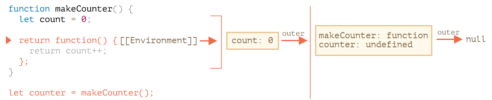

## 递归

### 递归

+ 递归：函数调用 自身。

```javascript
// 写一个函数 pow(x, n)，它可以计算 x 的 n 次方。换句话说就是，x 乘以自身 n 次。
//- pow(2, 2) = 4
//- pow(2, 3) = 8 
//- pow(2, 4) = 16

// 1. 迭代思路：使用 for 循环：
function pow1(x, n) {
    let res = 1;
    for (let i = 0; i < n; i++) {
        res *= x;
    }
    return res;
}
console.log( pow1(2, 3) ); // 8


// 2. 递归思路：简化任务，调用自身：
function pow2(x, n) {
    if (n == 1) {
        return x;
    } else {
        return x * pow2(x, n-1)
    }
    // return (n == 1) ? x : (x * pow(x, n - 1));
}
console.log( pow2(2, 3) ); // 8


function pow(x, n) {
  return (n == 1) ? x : (x * pow(x, n - 1));
}
```


### 执行上下文和堆栈

+ 有关正在运行的函数的执行过程的相关信息被存储在其 `执行上下文` 中。
+ 执行上下文 是一个内部数据结构，它包含有关函数执行时的详细细节：
  + 当前控制流所在的位置
  + 当前的变量
  + this 的值
  + 以及其它的一些内部细节。

+ 一个函数调用仅具有一个与其相关联的执行上下文。
+ 当一个函数进行嵌套调用时，将发生以下的事：
  + 当前函数被暂停；
  + 与它关联的执行上下文被一个叫做 执行上下文堆栈 的特殊数据结构保存；
  + 执行嵌套调用；
  + 嵌套调用结束后，从堆栈中恢复之前的执行上下文，并从停止的位置恢复外部函数。

```javascript
1    function pow(x, n) {
2        if (n == 1) {
3           return x;
4        } else {
5            return x * pow(x, n - 1);
6        }
7    }
     consloe.log( pow(2, 3) );


/*
pow(2, 3) 调用期间都发生了什么。

pow(2, 3):
调用 pow(2, 3) 的开始，执行上下文（context）会存储变量：x = 2, n = 3，执行流程在函数的第 1 行。
将其描绘如下：
	Context: { x: 2, n: 3, at line 1 } call pow(2, 3)
这是函数开始执行的时候。
条件 n == 1 结果为假，所以执行流程进入 if 的第二分支。
变量相同，但是行改变了，因此现在的上下文是：
	Context: { x: 2, n: 3, at line 5 } pow(2, 3)
为了计算 x * pow(x, n - 1)，需要使用带有新参数的新的 pow 子调用 pow(2, 2)。
 
pow（2, 2):
为了执行嵌套调用，JavaScript 会在 执行上下文堆栈 中记住当前的执行上下文。
这里调用相同的函数 pow。所有函数的处理都是一样的：
    1. 当前上下文被“记录”在堆栈的顶部。
    2. 为子调用创建新的上下文。
    3. 当子调用结束后 —— 前一个上下文被从堆栈中弹出，并继续执行。
下面是进入子调用 pow(2, 2) 时的上下文堆栈：
    Context: { x: 2, n: 2, at line 1 } call pow(2, 2)  // **
    Context: { x: 2, n: 3, at line 5 } call pow(2, 3)
新的当前执行上下文位于顶部（**），之前记住的上下文位于下方。
当完成子调用后 —— 很容易恢复上一个上下文，因为它既保留了变量，也保留了当时所在代码的确切位置。
 请注意：
    使用“行（line）”一词，因为在的示例中，每一行只有一个子调用，
    但通常一行代码可能会包含多个子调用，例如 pow(…) + pow(…) + somethingElse(…)。
    因此，更准确地说，执行是“在子调用之后立即恢复”的。
 
pow(2, 1):
重复该过程：在第 5 行生成新的子调用，现在的参数是 x=2, n=1。
新的执行上下文被创建，前一个被压入堆栈顶部：
   Context: { x: 2, n: 1, at line 1 } call pow(2, 1)
   Context: { x: 2, n: 2, at line 5 } call pow(2, 2)
   Context: { x: 2, n: 3, at line 5 } call pow(2, 3)
此时，有 2 个旧的上下文和 1 个当前正在运行的 pow(2, 1) 的上下文。


出口:
在执行 pow(2, 1) 时，与之前的不同，条件 n == 1 为真，因此 if 的第一个分支生效：
此时不再有更多的嵌套调用，所以函数结束，返回 2。
函数完成后，就不再需要其执行上下文了，因此它被从内存中移除。前一个上下文恢复到堆栈的顶部：
    Context: { x: 2, n: 2, at line 5 } call pow(2, 2)
    Context: { x: 2, n: 3, at line 5 } call pow(2, 3)
恢复执行 pow(2, 2)。它拥有子调用 pow(2, 1) 的结果，因此也可以完成 x * pow(x, n - 1) 的执行，并返回 4。
然后，前一个上下文被恢复：
   Context: { x: 2, n: 3, at line 5 } call pow(2, 3)
当它结束后，我们得到了结果 pow(2, 3) = 8。

递归深度为：3。

递归深度等于堆栈中上下文的最大数量。

注意内存要求。上下文占用内存，在的示例中，求 n 次方需要存储 n 个上下文，以供更小的 n 值进行计算使用。
    
而循环算法更节省内存：
        function pow(x, n) {
            let result = 1;
            for (let i = 0; i < n; i++) {
                result *= x;
            }
            return result;
        }
迭代 pow 的过程中仅使用了一个上下文用于修改 i 和 result。它的内存要求小，并且是固定了，不依赖于 n。

任何递归都可以用循环来重写。通常循环变体更有效。
*/
```


### 递归遍历

```javascript
let company = { // 是同一个对象，简洁起见被压缩了   
    // sales 部门
    //- 未来可能会分为 siteA 和 siteB
	sales: [{name: 'John', salary: 1000}, {name: 'Alice', salary: 1600 }],
    // development  部门
	development: {
        //  development的分支 sites  部门
		sites: [{name: 'Peter', salary: 2000}, {name: 'Alex', salary: 1800 }],
        //  development的分支 internals  部门
		internals: [{name: 'Jack', salary: 1300}]
	}
};

/*
对一个部门求和时，有两种可能的情况：
   1.要么是由一 数组 的人组成的“简单”的部门 —— 这样就可以通过一个简单的循环来计算薪资的总和。
   2.或者它是一个有 N 个子部门的 对象 —— 那么我们可以通过 N 层递归调用来求每一个子部门的薪资，然后将它们合并起来。

	第一种情况是由一数组的人组成的部门，这种情况很简单，是最基础的递归。
	第二种情况是得到的是对象。那么可将这个复杂的任务拆分成适用于更小部门的子任务。
	它们可能会被继续拆分，但很快或者不久就会拆分到第一种情况那样。
*/

// 获取所有薪资的总数
function sumSalaries(department) {
	if (Array.isArray(department)) { // 情况（1）
    	// 求数组的和
    	return department.reduce((prev, current) => prev + current.salary, 0); 
	} else { // 情况（2）
        let sum = 0;
        for (let subdep of Object.values(department)) {
          sum += sumSalaries(subdep); // 递归调用所有子部门，对结果求和
    }
    return sum;
}
console.log(sumSalaries(company)); // 7700
```


### 练习：对数字求和到给定值

```javascript
// 编写一个函数 sumTo(n) 计算 1 + 2 + ... + n 的和。
// 举个例子：
    //- sumTo(1) = 1
    //- sumTo(2) = 2 + 1 = 3
    //- sumTo(3) = 3 + 2 + 1 = 6
    //- sumTo(4) = 4 + 3 + 2 + 1 = 10
    //- ...
    //- sumTo(100) = 100 + 99 + ... + 2 + 1 = 5050

// 用三种方式实现：
    //- 使用循环。
    //- 使用递归，对 n > 1 执行 sumTo(n) = n + sumTo(n-1)。
    //- 使用 等差数列 求和公式.
```

```javascript
// 使用循环。
function sumTo1(n) { 
    let sum = 0;
    for (let i = 0; i <= n; i++) {
        sum += i;
    }
    return sum;
}
console.log( "循环: " + sumTo1(100) ); // 5050
```

```javascript
// 递归
function sumTo2(n) { 
    if (n == 1) {
        return 1;
    } else {
        return n + sumTo2(n - 1);
    }
}
console.log( "递归: " + sumTo2(100) ); // 5050
```

```javascript
// 等差数列 Sn=a1*n+[n*(n-1)*d]/2, a2-a1=d;a3-a2=d;a4-a3=d...an-a(n-1)=d
function sumTo3(n) { 
    return 1 * n + (n * (n - 1) * 1) / 2;
}
console.log( "等差数列: " + sumTo3(100) ); // 5050
```


## Rest 参数 ...

```javascript
//- 在 JavaScript 中，无论函数是如何定义的，都可以使用任意数量的参数调用函数。
function sum(a, b) {
  return a + b;
}
// 虽然这里不会因为传入“过多”的参数而报错。但是，在结果中只有前两个参数被计算进去了。
console.log( sum(1, 2, 3, 4, 5) );
```

```javascript
// Rest 参数可以通过使用三个点 ... 并在后面跟着包含剩余参数的数组名称，来将它们包含在函数定义中。
// 这些点的字面意思是“将剩余参数收集到一个 数组 中”。

// 例如，需要把所有的参数都放到数组 args 中：
function sumAll(...args) {
    let sum = 0;
    for (let arg of args) {
        sum += arg;
    }
    return sum;
}

console.log( sumAll(1) ); // 1
console.log( sumAll(1, 2) ); // 3
console.log( sumAll(1, 2, 3) ); // 6
```

```javascript
// 下面的例子把前两个参数定义为变量，并把剩余的参数收集到 titles 数组中：
function showName(firstName, lastName, ...titles) {
    console.log( firstName + ' ' + lastName ); // Julius Caesar

    // 剩余的参数被放入 titles 数组中
    // i.e. titles = ["Consul", "Imperator"]
    console.log( titles[0] ); // Consul
    console.log( titles[1] ); // Imperator
    console.log( titles.length ); // 2
}

showName("Julius", "Caesar", "Consul", "Imperator");
```

```javascript
// Rest 参数必须放到参数列表的末尾
    //- Rest 参数会收集剩余的所有参数，因此下面这种用法没有意义，并且会导致错误：

function f(arg1, ...rest, arg2) {  
	// error
}

// ...rest 必须处在最后。
```


## arguments 变量

+ arguments：
  + 类数组对象(不支持数组方法)，该对象按参数索引包含所有参数。
  + 是可迭代对象

```javascript
function show() {
    console.log(arguments.length);

    console.log(arguments[0]);
    console.log(arguments[1]);

    // 它是可遍历的
    // for(let arg of arguments) alert(arg);
}
show("java", "python", "go");  // 3, java, python
```

```javascript
// 箭头函数是没有 "arguments"
    //- 如果我们在箭头函数中访问 arguments，访问到的 arguments 并不属于箭头函数，
    //- 而是属于箭头函数外部的“普通”函数。

function f() {
  let showArg = () => console.log(arguments[0]);
  showArg();
}
f(1); // 1


function f2(i1, i2) {
    let showArg = (i1) => console.log(arguments[1]);
    showArg(i1);
}
f2(1, 2); // 2  arguments 属于箭头函数外部的“普通”函数。

// 箭头函数没有自身的 this。
```


## Spread 语法(对象解构)

Spread语法是ES6中的一个新特性，在需要使用多参数（函数参数）、多元素（数组迭代）或者多变量（解构赋值）的地方使用spread语法，可以让表达式的结果平铺化

+ `Array.from` 适用于类数组对象也适用于可迭代对象。
+ Spread 语法只适用于`可迭代对象`

```javascript
// 例如，内建函数 Math.max 会返回参数中最大的值：
console.log( Math.max(3, 5, 1) ); // 5

// 假如有一个数组 [3, 5, 1]，该如何用它调用 Math.max 呢？
// Math.max 希望传入的一个列表形式的数值型参数，而不是一个数组：
console.log( Math.max([3, 5, 1]) ); // NaN

// 使用 Spread 语法，把参数平铺化
let arr = [3, 5, 1];
console.log( Math.max( ...arr ) )  // 5

// 还可以通过这种方式传递多个可迭代对象：
let arr1 = [1, -2, 3, 4];
let arr2 = [8, 3, -8, 1];
console.log( Math.max(...arr1, ...arr2) ); // 8
// 还可以将 spread 语法与常规值结合使用：
console.log( Math.max(1, ...arr1, 2, ...arr2, 25) ); // 25
```

```javascript
// 还可以使用 spread 语法来合并数组：
let arr1 = [3, 5, 1];
let arr2 = [8, 9, 15];
let merged = [0, ...arr1, 2, ...arr2];
console.log(merged); // 0,3,5,1,2,8,9,15（0，然后是 arr1，然后是 2，然后是 arr2）
```

```javascript
// 用数组展示了 spread 语法，其实 `任何可迭代对象` 都可以。

// 例如，在这儿我们使用 spread 语法将字符串转换为字符数组：
let str = "Hello";
console.log(...str);  // H,e,l,l,o

// Spread 语法内部使用了迭代器来收集元素，与 for..of 的方式相同。
// 因此，对于一个字符串，for..of 会逐个返回该字符串中的字符，...str 也同理会得到 		
// "H","e","l","l","o" 这样的结果。

// 还可以使用 Array.from 将可迭代对象转换数组
console.log( Array.from(str) ); // [ 'H', 'e', 'l', 'l', 'o' ]

// Array.from 适用于类数组对象也适用于可迭代对象。
// Spread 语法只适用于可迭代对象。
```


获取一个 array/object 的副本

+ Object.assign()
+ spread 语法

```javascript
arr = [1, 2, 3];
let arrCopy = [...arr]; // 将数组 spread 到参数列表中,然后将结果放到一个新数组

// 两个数组中的内容相同吗？
console.log(JSON.stringify(arr) === JSON.stringify(arrCopy)); // true

// 两个数组相等吗？
console.log(arr === arrCopy); // false（它们的引用是不同的）

// 修改我们初始的数组不会修改副本：
arr.push(4);
console.log(arr); // 1, 2, 3, 4
console.log(arrCopy); // 1, 2, 3
```

```javascript
// 并且，也可以通过相同的方式来复制一个对象：
let obj = { a: 1, b: 2, c: 3 };
let objCopy = { ...obj }; 

// 两个对象中的内容相同吗？
console.log(JSON.stringify(obj) === JSON.stringify(objCopy)); // true

// 两个对象相等吗？
console.log(obj === objCopy); // false (not same reference)

// 修改初始的对象不会修改副本：
obj.d = 4;
console.log(JSON.stringify(obj)); // {"a":1,"b":2,"c":3,"d":4}
console.log(JSON.stringify(objCopy)); // {"a":1,"b":2,"c":3}

// 这种方式比使用 let arrCopy = Object.assign([], arr); 来复制数组，
// 或使用 let objCopy = Object.assign({}, obj); 来复制对象写起来要短得多
```


## 变量作用域 和 闭包

### 变量作用域

三种声明变量的方式：

+ `let`
+ `const`
+ `var`（过去留下来的方式）。

```javascript
// 代码块

// 如果在代码块 {...} 内声明了一个变量，那么这个变量只在该代码块内可见。
{
    let msg = "hello js";
    console.log(msg) // hello js
}
console.log(msg); // ReferenceError: msg is not defined


// 可以使用它来隔离一段代码，该段代码执行自己的任务，并使用仅属于自己的变量：
{
    let msg = "hello js";
    console.log(msg) // hello js

    
{
    let msg = "hello js";
    console.log(msg) // hello js
}
```

```javascript
// 对于 if，for 和 while 等，在 {...} 中声明的变量也仅在内部可见：
if (true) {
    let message = "hello java";
    console.log(message); // hello java
}
console.log(message); // ReferenceError: message is not defined


// 对于 for 和 while 循环也是如此：
for (let i = 0; i < 3; i++) {
    // 变量 i 仅在这个 for 循环的内部可见
    console.log(i); // 0，然后是 1，然后是 2
}
console.log(i); // Error, no such variable
```


### 闭包

```javascript
// 嵌套函数

// 当一个函数是在另一个函数中创建的时，那么该函数就被称为“嵌套”的。
function sayHiBye(name) {
    // 辅助嵌套函数使用如下
    function getName() {
        return name;
    }
    console.log( "Hello, " + getName() );
    console.log( "Bye, " + getName() );
}

sayHiBye("梓晴");  // Hello, 梓晴, Bye, 梓晴
```

```javascript
function makeCounter() {
    let count = 0;
    return function() {
        return count++;
    };
}

let counter = makeCounter();

console.log( counter() ); // 0
console.log( counter() ); // 1
console.log( counter() ); // 2
```


### 词法环境

1. Step 1. 变量
   + 在 JavaScript 中，每个运行的函数，代码块 {...} 以及整个脚本，都有一个被称为 词法环境（Lexical Environment） 的内部（隐藏）的关联对象。
   + 词法环境对象由两部分组成：
     + **环境记录（Environment Record）** —— 一个存储所有局部变量作为其属性（包括一些其他信息，例如 `this` 的值）的对象。
     + 对 **外部词法环境** 的引用，与外部代码相关联。
   + 一个“变量”只是 **环境记录** 这个特殊的内部对象的一个属性。“获取或修改变量”意味着“获取或修改词法环境的一个属性”。

> 举个例子，这段没有函数的简单的代码中只有一个词法环境：
>
> ```javascript
> let phrase = "hello";  ---phrase: "Hello"(Lexical Environment) --outer--> null
> console.log(phrase);
> // 这就是所谓的与整个脚本相关联的 全局 词法环境。
> //（Lexical Environment） 表示环境记录（变量存储），箭头表示外部引用。全局词法环境没有外部引用，所以箭头指向了 null。
> ```
>
> 随着代码开始并继续运行，词法环境发生了变化。
>
> ```javascript
> execution start   --phrase:<uninitialized> (Lexical Environment) --outer--> null
> let phrase;       --phrase: undefined (Lexical Environment)
> phrase = "hello"; --phrase: "Hello"  (Lexical Environment)
> phrase = "bye";   --phrase: "bye"  (Lexical Environment)
> 
> // 右侧的矩形演示了执行过程中全局词法环境的变化：
> 	// 1.当脚本开始运行，词法环境预先填充了所有声明的变量。
> 		// 最初，它们处于“未初始化（Uninitialized）”状态。这是一种特殊的内部状态，
> 		// 这意味着引擎知道变量，但是在用 let 声明前，不能引用它。几乎就像变量不存在一样。
> 	// 2.然后 let phrase 定义出现了。它尚未被赋值，因此它的值为 undefined。
> 	//   从这一刻起，就可以使用变量了。
>     // 3.phrase 被赋予了一个值。
>     // 4.phrase 的值被修改。
> 
> // 变量是特殊内部对象的属性，与当前正在执行的（代码）块/函数/脚本有关。
> // 操作变量实际上是操作该对象的属性。
> ```


> 词法环境是一个规范对象：
>
> + 它仅仅是存在于 编程语言规范 中的“理论上”存在的，用于描述事物如何运作的对象。
> + 无法在代码中获取该对象并直接对其进行操作。
>
> + JavaScript 引擎同样可以优化它，比如清除未被使用的变量以节省内存和执行其他内部技巧等，
>   但显性行为应该是和上述的无差。


2. Step 2. 函数声明

   +  一个函数其实也是一个值，就像变量一样。
   +  不同之处在于函数声明的初始化会被立即完成。
   + 当创建了一个词法环境（Lexical Environment）时，函数声明会立即变为`即用型函数`（不像 let 那样直到声明处才可用）。这就是为什么我们可以在（函数声明）的定义之前调用函数声明。

   ```javascript
   // 例如，这是添加一个函数时全局词法环境的初始状态：
   execution start --phrase:<uninitialized> say: function --outer--> null
   let phrase = "hello";          
   function say(name) {
       alter(`${name ${name}}`);
   }
   
   // 正常来说，这种行为仅适用于函数声明，而 不适用于将函数分配给变量的函数表达式，
   // 例如 let say = function(name)...。
   ```

   

3. Step 3. 内部和外部的词法环境

   在一个函数运行时，在调用刚开始时，会自动创建一个新的词法环境以存储这个调用的局部变量和参数。

   

   在这个函数调用期间，有两个词法环境：内部一个（用于函数调用）和外部一个（全局）：

   - 内部词法环境与 `say` 的当前执行相对应。它具有一个单独的属性：`name`，函数的参数。我们调用的是 `say("John")`，所以 `name` 的值为 `"John"`。
   - 外部词法环境是全局词法环境。它具有 `phrase` 变量和函数本身。

   内部词法环境引用了 `outer`。

   **当代码要访问一个变量时 —— 首先会搜索内部词法环境，然后搜索外部环境，然后搜索更外部的环境，以此类推，直到全局词法环境。**

   如果在任何地方都找不到这个变量，那么在严格模式下就会报错（在非严格模式下，为了向下兼容，给未定义的变量赋值会创建一个全局变量）。

   在这个示例中，搜索过程如下：

   - 对于 `name` 变量，当 `say` 中的 `alert` 试图访问 `name` 时，会立即在内部词法环境中找到它。
   - 当它试图访问 `phrase` 时，然而内部没有 `phrase`，所以它顺着对外部词法环境的引用找到了它。


4. Step 4. 返回函数

   ```javascript
   function makeCounter() {
     let count = 0;
   
     return function() {
       return count++;
     };
   }
   let counter = makeCounter();
   ```

   在每次 `makeCounter()` 调用的开始，都会创建一个新的词法环境对象，以存储该 `makeCounter` 运行时的变量。

   因此，我们有两层嵌套的词法环境，就像上面的示例一样：

   

   不同的是，在执行 `makeCounter()` 的过程中创建了一个仅占一行的嵌套函数：`return count++`。我们尚未运行它，仅创建了它。

   所有的函数在“诞生”时都会记住创建它们的词法环境。从技术上讲，这里没有什么魔法：所有函数都有名为 `[[Environment]]` 的隐藏属性，该属性保存了对创建该函数的词法环境的引用。

   

   因此，`counter.[[Environment]]` 有对 `{count: 0}` 词法环境的引用。这就是函数记住它创建于何处的方式，与函数被在哪儿调用无关。`[[Environment]]` 引用在函数创建时被设置并永久保存。

   稍后，当调用 `counter()` 时，会为该调用创建一个新的词法环境，并且其外部词法环境引用获取于 `counter.[[Environment]]`：

   

   现在，当 `counter()` 中的代码查找 `count` 变量时，它首先搜索自己的词法环境（为空，因为那里没有局部变量），然后是外部 `makeCounter()` 的词法环境，并且在哪里找到就在哪里修改。

   **在变量所在的词法环境中更新变量。**

   这是执行后的状态：

   

   如果调用 `counter()` 多次，`count` 变量将在同一位置增加到 `2`，`3` 等。


### 垃圾收集

通常，函数调用完成后，会将词法环境和其中的所有变量从内存中删除。因为现在没有任何对它们的引用了。

与 JavaScript 中的任何其他对象一样，`词法环境`仅在`可达时`才会被保留在内存中。

但是，如果有一个嵌套的函数在函数结束后仍可达，则它将具有引用词法环境的 [[Environment]] 属性。

```javascript
// 在下面这个例子中，即使在函数执行完成后，词法环境仍然可达。因此，此嵌套函数仍然有效。
function f() {
    let value = 123;
    return function() {
        console.log(value);
    }
}

let g = f(); // g.[[Environment]] 存储了对相应 f() 调用的词法环境的引用

// 请注意，如果多次调用 f()，并且返回的函数被保存，那么所有相应的词法环境对象也会保留在内存中。
// 下面代码中有三个这样的函数：
let arr = [f(), f(), f()];

// 当词法环境对象变得不可达时，它就会死去（就像其他任何对象一样）。它仅在至少有一个嵌套函数引用它时才存在。

// 嵌套函数被删除后，其封闭的词法环境（以及其中的 value）也会被从内存中删除：
g = null;
```

### 练习

```javascript
// 函数 sayHi 使用外部变量。当函数运行时，将使用哪个值？

let name = "zhong";
function sayHi() {
    console.log("hello " + name);
}
name = "long";
sayHi(); // hello long

// 函数将从内到外依次在对应的词法环境中寻找目标变量，它使用最新的值。

// 旧变量值不会保存在任何地方。当一个函数想要一个变量时，它会从自己的词法环境或外部词法环境中获取当前值。
```

```javascript
// 下面的 makeWorker 函数创建了另一个函数并返回该函数。可以在其他地方调用这个新函数。
// 它是否可以从它被创建的位置或调用位置（或两者）访问外部变量？
function makeWorker() {
    let name = "Pete";
 
    return function() {
        console.log(name);
    };
}
  
let name = "John";

// create a function
let work = makeWorker();

// call it
work(); //  Pete.

// 但如果在 makeWorker() 中没有 let name，那么将继续向外搜索并最终找到全局变量，
// 在这种情况下，结果将是 "John"。
```

```javascript
// 用相同的 makeCounter 函数创建了两个计数器（counters）：counter 和 counter2。
// 它们是独立的吗？第二个 counter 会显示什么？0,1 或 2,3 还是其他？
function makeCounter() {
    let count = 0;
  
    return function() {
        return count++;
    };
}
  
let counter = makeCounter();
let counter2 = makeCounter();

console.log( counter() ); // 0
console.log( counter() ); // 1

console.log( counter2() ); // ?  0
console.log( counter2() ); // ?  1

// 函数 counter 和 counter2 是通过 makeCounter 的不同调用创建的。
// 因此，它们具有独立的外部词法环境，每一个都有自己的 count。
```

```javascript
// 通过构造函数创建了一个 counter 对象。
// 它能正常工作吗？它会显示什么呢？
function Counter() {
    let count = 0;
  
    this.up = function() {
        return ++count;
    };
    this.down = function() {
        return --count;
    };
}
  
counter = new Counter();

// 这两个嵌套函数都是在同一个词法环境中创建的，所以它们可以共享对同一个 count 变量的访问： 
console.log( counter.up() );   // ?     1
console.log( counter.up() );   // ?     2
console.log( counter.down() ); // ?     1
```

```javascript
// if 内的函数
// 最后一行代码的执行结果是什么？
let phrase = "Hello";

if (true) {
  let user = "John";

  function sayHi() {
    console.log(`${phrase}, ${user}`);
  }
}

sayHi(); // Hello, John
```

```javascript
// 闭包 sum
// 编写一个像 sum(a)(b) = a+b 这样工作的 sum 函数。
// 是的，就是这种通过双括号的方式（并不是错误）。
// 举个例子：
// sum(1)(2) = 3
// sum(5)(-1) = 4

function sum(a) {
    return function(b) {
        return a + b;
    }
}

console.log( sum(1)(2) );   
console.log( sum(5)(-1) );
```

```javascript
// 下面这段代码的结果会是什么？
let x = 1;

function func() {
  console.log(x); // ReferenceError: Cannot access 'x' before initialization

  let x = 2;
}
func();  // 答案：error。


// 在这个例子中，可以观察到“不存在”的变量和“未初始化”的变量之间的特殊差异。

// 从程序执行进入代码块（或函数）的那一刻起，变量就开始进入“未初始化”状态。
// 它一直保持未初始化状态，直至程序执行到相应的 let 语句。

// 换句话说，一个变量从技术的角度来讲是存在的，但是在 let 之前还不能使用。

// 下面的这段代码证实了这一点。
function func2() {

  // 引擎从函数开始就知道局部变量 x，
  // 但是变量 x 一直处于“未初始化”（无法使用）的状态，直到结束 let（“死区”）
  // 因此答案是 error

  console.log(x); // ReferenceError: Cannot access 'x' before initialization

  let x = 2;
}
// 变量暂时无法使用的区域（从代码块的开始到 let）有时被称为“死区”。
```

```javascript
// 有一个内建的数组方法 arr.filter(f)。它通过函数 f 过滤元素。
// 如果它返回 true，那么该元素会被返回到结果数组中。

// 制造一系列“即用型”过滤器：
    //- inBetween(a, b) —— 在 a 和 b 之间或与它们相等（包括）。
    //- inArray([...]) —— 包含在给定的数组中。

// 用法如下所示：
    //- arr.filter(inBetween(3,6)) —— 只挑选范围在 3 到 6 的值。
    //- arr.filter(inArray([1,2,3])) —— 只挑选与 [1,2,3] 中的元素匹配的元素。

// 例如：
/* .. inBetween 和 inArray 的代码 */
let arr = [1, 2, 3, 4, 5, 6, 7];

console.log( arr.filter(inBetween(3, 6)) ); // 3,4,5,6

console.log( arr.filter(inArray([1, 2, 10])) ); // 1,2


function inBetween(a, b) {
    return item => item >= a && item <= b;
}

function inArray(arr) {
    return item => arr.includes( item )
}
```

```javascript
// 按字段排序
let users = [
  { name: "John", age: 20, surname: "Johnson" },
  { name: "Pete", age: 18, surname: "Peterson" },
  { name: "Ann", age: 19, surname: "Hathaway" }
];

// 通常的做法应该是这样的：

// 通过 name (Ann, John, Pete)
// users.sort((a, b) => a.name > b.name ? 1 : -1);

// 通过 age (Pete, Ann, John)
// users.sort((a, b) => a.age > b.age ? 1 : -1);


// 我们可以让它更加简洁吗，比如这样？
users.sort(byField('name'));
console.log(users);
users.sort(byField('age'));
console.log(users);

// 这样我们就只需要写 byField(fieldName)，而不是写一个函数。
// 编写函数 byField 来实现这个需求

function byField(fieldName) {
    return (a, b) => a[fieldName] > b[fieldName] ? 1 : -1
}
```

```javascript
// 下列的代码创建了一个 shooters 数组。
// 每个函数都应该输出其编号。但好像出了点问题……
function makeArmy() {
  let shooters = [];

  let i = 0;
  while (i < 10) {
    let shooter = function() { // 创建一个 shooter 函数，
      console.log( i ); // 应该显示其编号
    };
    shooters.push(shooter); // 将此 shooter 函数添加到数组中
    i++;
  }
  // 返回 shooters 数组
  return shooters;
}

let army = makeArmy();
// 所有的 shooter 显示的都是 10，而不是它们的编号 0, 1, 2, 3...
army[0](); // 编号为 0 的 shooter 显示的是 10
army[1](); // 编号为 1 的 shooter 显示的是 10
army[2](); // 10，其他的也是这样。

// 为什么所有的 shooter 显示的都是同样的值？

// 修改代码以使得代码能够按照我们预期的那样工作。

function makeArmy2() {
    let shooters = [];
  
    let i = 0;

    while (i < 10) {
        let shooter = function(i) { // 创建一个 shooter 函数，
            return function() {
                console.log( i ); // 应该显示其编号
            }
        };
        shooters.push(shooter(i)); // 将此 shooter 函数添加到数组中
        i++;
    }
  
    // 返回 shooters 数组
    return shooters;
}
  
let army2 = makeArmy2();
army2[0](); 
army2[1](); 
army2[2]();


function makeArmy3() {
    let shooters = [];
  
    let i = 0;

    while (i < 10) {
        
        // 在 while {...} 块的每次迭代中，都会创建一个新的词法环境。
        // 因此，要解决此问题，我们可以将 i 的值复制到 while {...} 块内的变量中，如下所示：
        let j = i;

        let shooter = function() { // 创建一个 shooter 函数，
            console.log( j ); // 应该显示其编号
        };
        shooters.push(shooter); // 将此 shooter 函数添加到数组中
        i++;
    }
  
    // 返回 shooters 数组
    return shooters;
}
  
let army3 = makeArmy3();
army3[0](); 
army3[1](); 
army3[2]();
```

